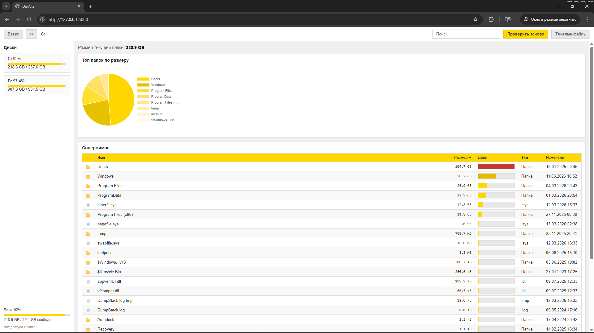

# DiskViz — визуализация диска

Небольшое веб-приложение для просмотра содержимого дисков Windows и анализа занятого места. Заходишь в папки, смотришь, кто сколько тянет, находишь тяжёлые файлы.



## Что умеет

- **Диски** — в боковой панели список разделов (C:, D: и т.д.) с заливкой по занятости.
- **Проводник** — навигация по папкам, хлебные крошки, «на уровень выше».
- **Размеры** — для каждой папки/файла показывается размер; папки сортируются по убыванию размера.
- **Топ папок** — горизонтальная диаграмма по размеру для первых 8 папок в текущей директории.
- **Тяжёлые файлы** — кнопка «Тяжёлые файлы» открывает список топ-30 по размеру в текущей папке (рекурсивно).
- **Поиск** — фильтрация строк таблицы по имени.

Если у папки нет доступа (например, `C:\Users` без прав) — размер отображается как «нет доступа». Папки-ссылки (junction/symlink), например часть путей в `Program Files`, показываются как «ссылка» и в общий размер не входят, чтобы не дублировать одни и те же данные (иначе WindowsApps мог бы «съедать» весь диск в отчёте).

**Как дать доступ к папкам вроде Users/AppData:** запусти приложение от имени администратора (ПКМ по ярлыку/консоли → «Запуск от имени администратора») или выдай своей учётной записи права на чтение нужной папки (Свойства папки → Безопасность → Изменить → Добавить пользователя и права «Чтение»).

## Запуск

```bash
# Окружение по желанию
pip install -r requirements.txt
python app.py
```

В консоли будет что-то вроде: `SpaceViz Explorer запущен — открой http://127.0.0.1:5000`. Открываешь в браузере этот адрес.

## Стек

- **Бэкенд:** Flask.
- **Фронт:** HTML, JS, Tailwind CSS, Chart.js, Anime.js.
- **Платформа:** Windows (используются пути вроде `C:\`, `os.scandir`, `shutil.disk_usage`).

## Структура проекта

- `app.py` — Flask-приложение, маршруты `/`, `/api/drives`, `/api/list`, `/api/list/stream` (SSE), `/api/largest`; подсчёт размеров, учёт junction/symlink, человекочитаемый вывод.
- `templates/index.html` — разметка и подключение стилей/скриптов.
- `static/js/main.js` — загрузка дисков и списка папок, навигация, диаграмма, таблица, модалка тяжёлых файлов.

## Ограничения

- **Кэш размеров** сохраняется в файл `diskviz_cache.json` в папке приложения. При следующем открытии папки данные берутся из кэша (без долгого ожидания). Кнопка **«Проверить заново»** сбрасывает кэш для текущей папки и запускает пересканирование.
- Список папок по потоковому API (`/api/list/stream`): элементы появляются по мере подсчёта; в интерфейсе отображается, какая папка в данный момент сканируется.
- Размер папки считается рекурсивно; папки-ссылки (junction/symlink) не учитываются в размере, чтобы не дублировать данные.
- Рассчитано на локальный запуск и использование на одной машине.

Если что-то не открывается или размеры «не сходятся» — часто это ограничения доступа Windows к системным/чужим папкам; запуск от администратора может частично помочь, но не обязателен для обычного просмотра своих данных.

